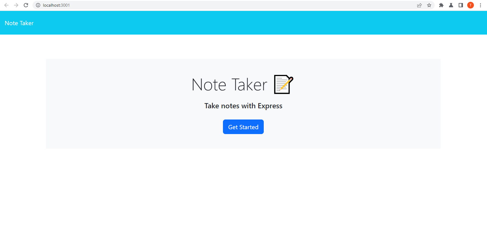
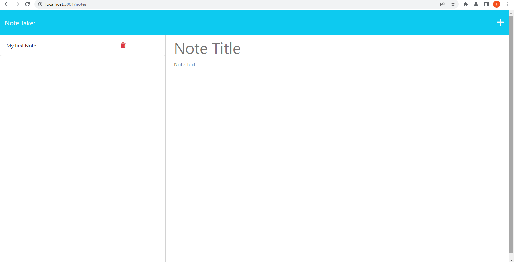

# Notes To Go Note Taker

## Description

This is a note taking application that allows the user to create and save, notes. The application uses an express backend and saves and retrieves note data from a JSON file. The application is deployed on Heroku. Users can click on their previously saved notes and see them expanded on the right side of the screen. This project was put together to work on my skills with express.js and Heroku.

## Table of Contents 

- [Installation](#installation)
- [Usage](#usage)
- [Credits](#credits)
- [License](#license)
- [Contact](#contact)

## Installation

Installation is only required if you are running locally and not through Heroku. To install the necessary dependencies, first clone the project repository from Github @ https://github.com/TamasPinter/notesToGo . Open the repository in your code editor and run "npm i" from the terminal. This will install all dependencies and packages needed to run the application. Once the installation is complete, run "npm start" from the terminal. This will start the server and the application will be running on localhost:3001.

If you are accessing through Heroku at https://tamaspinternotestogo.herokuapp.com/ , no installation is required.

## Usage

Once you are installed locally or on Heroku, you can start using the application. Click on the "Get Started" button to start creating notes. You can enter a title and a note body. Once you have entered your note, click on the save icon on the top right corner of the screen. Your note will be saved and you can see it on the left side of the screen. You can click on the note to see it expanded on the right side of the screen. 

. 

## Credits

List your collaborators, if any, with links to their GitHub profiles.

If you used any third-party assets that require attribution, list the creators with links to their primary web presence in this section.

If you followed tutorials, include links to those here as well.

## License

MIT License

Copyright (c) 2023 TamasPinter

Permission is hereby granted, free of charge, to any person obtaining a copy
of this software and associated documentation files (the "Software"), to deal
in the Software without restriction, including without limitation the rights
to use, copy, modify, merge, publish, distribute, sublicense, and/or sell
copies of the Software, and to permit persons to whom the Software is
furnished to do so, subject to the following conditions:

The above copyright notice and this permission notice shall be included in all
copies or substantial portions of the Software.

THE SOFTWARE IS PROVIDED "AS IS", WITHOUT WARRANTY OF ANY KIND, EXPRESS OR
IMPLIED, INCLUDING BUT NOT LIMITED TO THE WARRANTIES OF MERCHANTABILITY,
FITNESS FOR A PARTICULAR PURPOSE AND NONINFRINGEMENT. IN NO EVENT SHALL THE
AUTHORS OR COPYRIGHT HOLDERS BE LIABLE FOR ANY CLAIM, DAMAGES OR OTHER
LIABILITY, WHETHER IN AN ACTION OF CONTRACT, TORT OR OTHERWISE, ARISING FROM,
OUT OF OR IN CONNECTION WITH THE SOFTWARE OR THE USE OR OTHER DEALINGS IN THE
SOFTWARE.

## Contact

If you have any questions about the repo, open an issue or contact me directly at:
brolli_673@hotmail.com. You can find more of my work at [TamasPinter](https://github.com/TamasPinter).
---